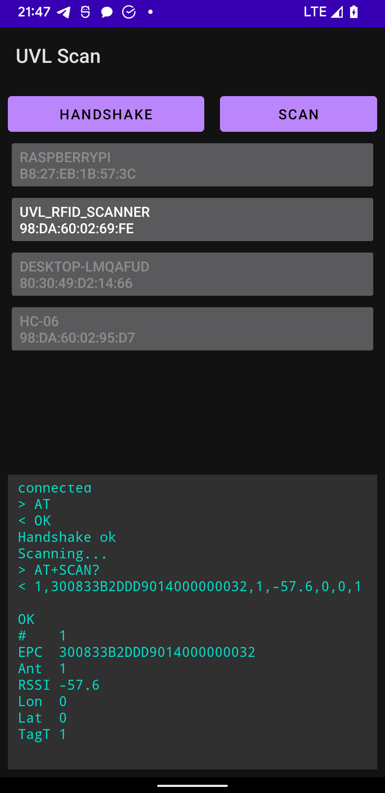

# UVL RFID scanner Bluetooth protocol reference application

> Protocol Version: 1.0.0 

A reference implementation of the UVL RFID scanner Bluetooth protocol.

<p align="center">
  
</p>

UVL's partner will be integrating the protocol into their application.  

The partner's application is designed to run on a portable data terminal (PDT) under the Android operating system. The partner is to implement the Bluetooth protocol as they see fit, however this application is provided as a reference.

## Setup
- Build and install this application `UVL Scan` on target android device
- Turn on the UVL RFID scanner
- Enable Bluetooth on the PDT
- Open settings app
- Open Bluetooth and pair a new device
- Select the `UVL_RFID_SCANNER` device from list
- When prompted enter pair code `1234`
- As soon as the pairing is done you are ready to scan

## Scanning
- Turn on the UVL RFID scanner
- Enable Bluetooth on the PDT
- Open the `UVL Scan` app
- Wait for device list to load
- Select the `UVL_RFID_SCANNER` device from list
- Wait for connection to go through and for the `Scan` button to become active
- Click the `Scan` button
- Scan a RFID label with the scanner
- Observe the label's parameters in the log on the application screen
- To disconnect click the `UVL_RFID_SCANNER` in the device list

## Protocol

The protocol is based on the Hayes command set (AT command set) commonly seen in small serial devices. General information can be found at https://en.wikipedia.org/wiki/Hayes_command_set

The commands are as follows:

Command: `AT\r\n` - generic handshake, check is device is present
```
AT
```
Response: `OK\r\n` - scanner healthy and ready
```
AT
OK
```

Command: `AT+SCAN?` - request scan
```
AT
OK
AT+SCAN?
``` 
Response: `1,300833B2DDD9014000000032,1,-57.6,0,0,1\r\n\r\nOK\r\n`
```
AT
OK
1,300833B2DDD9014000000032,1,-57.6,0,0,1

OK
```

Response consists of:
- data `1,300833B2DDD9014000000032,1,-57.6,0,0,1\r\n`
- empty line (`\r\n`)
- OK (`OK\r\n`)

Data fields are separated by a single comma.

Data fields are as follows:
- `1` Scan number in result sequence
- `300833B2DDD9014000000032` Electronic Product Code (EPC)
- `1` Antenna number
- `-57.6` Received signal strength indication (RSSI)
- `0` GPS longitude of scanner
- `0` GPS latitude of scanner
- `1` Tag type

### Extras *(not yet implemented)*  
- ~~Command: `AT+SCAN=1\r\n` - start continuous scanning~~  
- ~~Command: `AT+SCAN=0\r\n` - stop continuous scanning~~