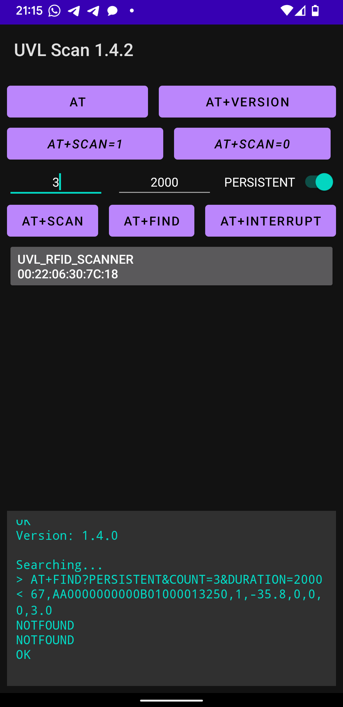

# UVL RFID scanner Bluetooth protocol reference application

> Protocol Version: 1.4.0  
> Application Version: 1.4.2

A reference implementation of the UVL RFID scanner Bluetooth protocol.

<p align="center">
  
</p>

UVL's partner will be integrating the protocol into their application.  

The partner's application is designed to run on a portable data terminal (PDT) under the Android operating system. The partner is to implement the Bluetooth protocol as they see fit, however this application is provided as a reference.

## Setup
- Build and install this application `UVL Scan` on target android device
- Turn on the UVL RFID scanner
- Enable Bluetooth on the PDT
- Open settings app
- Open Bluetooth and pair a new device
- Select the `UVL_RFID_SCANNER` device from list
- When prompted enter pair code `1234`
- As soon as the pairing is done you are ready to scan

## Scanning
- Turn on the UVL RFID scanner
- Enable Bluetooth on the PDT
- Open the `UVL Scan` app
- Wait for device list to load
- Select the `UVL_RFID_SCANNER` device from list
- Wait for connection to go through and for the `AT+SCAN?` button to become active
- Click the `AT+SCAN?` button
- Scan a RFID label with the scanner
- Observe the label's parameters in the log on the application screen
- To disconnect click the `UVL_RFID_SCANNER` in the device list

## Protocol

The protocol is inspired by the Hayes command set (AT command set) commonly seen in small serial devices. General information can be found at https://en.wikipedia.org/wiki/Hayes_command_set

The query, or params part of the commands that go after `?` are standart URL query paramers, their order does not matter, only their presence. More info can be found at https://en.wikipedia.org/wiki/Query_string

***The protocol is to be implemented as asynchronous***, there should be no expectation that the responses to the commands will follow immedeatly after the commands were sent, because there might be other continuous commands running in that period that would send their data before the current command is recievd and parsed. `+HB\r\n` heartbeat messages also come between any commands that are running and should be handled apropriety by the side waiting for a command response.

## Heartbeat: `+HB\r\n` - every 1 second

Every 1 second the module send a heartbeat command `+HB\r\n`.

These messages are sent by an internal timer without regard for any command or even connection state between the connected systems.

Please note that as `+HB\r\n` heartbeat messages run on an internal timer and do not wait for any connection to be established it is possible to resieve a full or even a partial `+HB\r\n` message right after connecting to the module before sending any `AT` commands. The system implementing this protocol must thus be resistant to receiving such partial message noise. A state machine based on the `switch` statment combined with a state contaier is advisable for implementation.

Example for Heartbeat messages in the protocol log (note the `B\r\n` in the beginning the is partial of the `+HB\r\n` that was being sent as the connection was being established, also note the differences in when the `+HB` is received in regards to the `AT+SCAN` and `AT+INTERRUPT` request and responses, it can be recieved between any response lines as it is running asynchronously), read on commands bellow for more:

```log
B
+HB
+HB
AT
+HB
OK
+HB
AT+SCAN?COUNT=3&DURATION=3000
+HB
1,300833B2DDD9014000000032,1,-57.6,0,0,1
+HB
+HB
NOTFOUND
NOTFOUND
OK
+HB
+HB
AT+SCAN
OK
+HB
+HB
+HB
AT+INTERRUPT
+HB
INTERRUPTED AT+SCAN
OK
AT+SCAN
+HB
OK
+HB
+HB
AT+INTERRUPT
INTERRUPTED AT+SCAN
+HB
OK

```

## Commands

**Each command must be followed by the standard line ending `\r\n`.**

The commands are as follows:

## Command: `AT\r\n` - generic handshake, check if device is present
```
AT
```
Response: `OK\r\n` - scanner healthy and ready
```
AT
OK
```

## Command: `AT+VERSION\r\n` - get device's protocol version
```
AT+VERSION
```
The response is:
- protocol version in format of `<major>.<minor>.<patch>` followed by the standard line ending `\r\n`
- the end of command `OK\r\n`.

```
AT+VERSION
1.4.0
OK
```

## Command: `AT+INTERRUPT\r\n` - interrupt a currently running command
> **Note**  
> Its recommended to use this instead of the deprecated ~~`AT+SCAN=0\r\n`~~, it is more explicit about what it does, additionaly providing info about what command was interrupted if any
```
AT+INTERRUPT
```

If a **command was running**, the response is:
- a key word `INTERRUPTED`
- a single white space
- a signature of the interrupted command followed by the standard line ending `\r\n`
- the end of command `OK\r\n`.
```
AT+INTERRUPT
INTERRUPTED AT+SCAN?COUNT=inf
OK
```

If **no command was running**, the response is:
- a key word `INTERRUPTED`
- a single white space
- a key word `NOTHING` followed by the standard line ending `\r\n`
- the end of command `OK\r\n`.
```
AT+INTERRUPT
INTERRUPTED NOTHING
OK
```

## Command: `AT+SCAN<?params...>\r\n` - request a scan with the given parameters
```
AT+SCAN
```

The `<params...>` can be:
- `COUNT` (default `1`) the amount of labels to scan and return back
- `DURATION` (default `inf`) the amount of milliseconds to scan for

Each parameter can be a number or an `inf` meaning infinite.

|`COUNT`|`DURATION`|Meaning
|-|-|-|
|n|n|Wait to scan `n` labes for `n` milliseconds|
|n|inf|Wait to scan `n` labes infinetly|
|inf|n|Scan any amount of labels within `n` milliseconds|
|inf|inf|Scan all labels until explicitly interrupted|

Given the default values the follwoing short versions can be used:
- `AT+SCAN` wait indefinitly for and scan 1 label
- `AT+SCAN?COUNT=inf` enable continuous scanning, same as the deprecated ~~`AT+SCAN=1`~~

When a commands runs infintely, the labels' data is sent immedetely after it is scanned, there can be 2 types of responses to this command:

If the command **will run infinetly** (both `COUNT` and `DURATION` are `inf`), the response is:

- the end of command `OK\r\n`, to acknowledge the succes of the command
- infinite scanned labels' data according to <a href="#label-data-format">label data format</a>, each followed by the standard line ending `\r\n`.
```
AT+SCAN?COUNT=inf
OK
1,300833B2DDD9014000000032,1,-57.6,0,0,1
2,300833B2DDD9014000000033,1,-58.1,0,0,1
3,300833B2DDD9014000000034,1,-52.3,0,0,1
```

If the command **will not run infinetly**, the response is:

- multiple scanned label info according to <a href="#label-data-format">label data format</a> or a <a href="#notfound">`NOTFOUND`</a> keyword, each followed by the standard line ending `\r\n`
- the end of command `OK\r\n` to acknowledge successful scan end.
```
AT+SCAN?COUNT=3
1,300833B2DDD9014000000032,1,-57.6,0,0,1
2,300833B2DDD9014000000033,1,-58.1,0,0,1
3,300833B2DDD9014000000034,1,-52.3,0,0,1
OK
```

## Command: `AT+FIND?<filter&params...>\r\n` - search for labes using a filter with parameters
```
AT+FIND?PERSISTENT&COUNT=2&DURATION=20000
```

The `filter` can be:
- `BEST` find the labes with best RSSI, sort by it and send the best first
- `PERSISTENT` find the labes that are the most persistent or stable, to be used on a mooving scanner to detect the labes that are moving with it

The `<params...>` must be numbers, no `inf` or missing values allowed:
- `COUNT` (no default) the amount of labels to scan and return back
- `DURATION` (no default) the amount of milliseconds to scan for

The response is:

- multiple scanned label info according to <a href="#labelq-data-format">label with quality/confidence data format</a> or a <a href="#notfound">`NOTFOUND`</a> keyword, each followed by the standard line ending `\r\n`
- the end of command `OK\r\n` to acknowledge successful scan end.
```
AT+FIND?PERSISTENT&COUNT=4&DURATION=20000
1,300833B2DDD9014000000032,1,-57.6,0,0,1,0.988
2,300833B2DDD9014000000033,1,-58.1,0,0,1,0.873
3,300833B2DDD9014000000034,1,-52.3,0,0,1,0.456
NOTFOUND
OK
```

## Errors

If a command encounters an error during execution, such as recieving incorrect parameters, an error is thrown and the command completes with `OK`.

The error syntax is a follows:

- a key word `ERROR`
- a single white space
- a string describing the error followed by the standard line ending `\r\n`
- the end of command `OK\r\n`.

For example:
```
AT+FIND
ERROR Filter not provided
OK

AT+FIND?PERSISTENT
ERROR Count not provided
OK

AT+FIND?PERSISTENT?COUNT=inf
ERROR Count can not be inf
OK
```

<h2 id="label-data-format">Label data format</h2>
Scan response consists of data fields are separated by a single comma:

```
1,300833B2DDD9014000000032,1,-57.6,0,0,1
```

Data fields are as follows:
- `1` Scan number in result sequence
- `300833B2DDD9014000000032` Electronic Product Code (EPC)
- `1` Antenna number
- `-57.6` Received signal strength indication (RSSI)
- `0` GPS longitude of scanner
- `0` GPS latitude of scanner
- `1` Tag type

<h2 id="labelq-data-format">Label with Quality/Confidence data format</h2>
When using search commands an additonal field is provided - quality or confidence level:

```
1,300833B2DDD9014000000032,1,-57.6,0,0,1,2.973
```

Data fields are as follows:
- `1` Scan number in result sequence
- `300833B2DDD9014000000032` Electronic Product Code (EPC)
- `1` Antenna number
- `-57.6` Received signal strength indication (RSSI)
- `0` GPS longitude of scanner
- `0` GPS latitude of scanner
- `1` Tag type
- `2.973` Quality or confidence level


## <span id="notfound">`NOTFOUND` keyword</span>
If a `COUNT` is requested, and more labes are scanned, the latter labes are dismissed. If a `DURATION` is also provided and by the time it ends less labes are scanned then requested the missing labesl are represented in a response by a `NOTFOUND` keyword:
```
AT+SCAN?COUNT=3&DURATION=1000
1,300833B2DDD9014000000032,1,-57.6,0,0,1
NOTFOUND
NOTFOUND
OK
```

## Deprecated command: ~~`AT+SCAN=1\r\n`~~ - enable continuous scanning
> **Warning**  
> Deprecated since 1.4.0, use `AT+SCAN?COUNT=inf` instead

```
AT+SCAN=1
```
Response: `OK\r\n` - continous scanning enabled
```
AT+SCAN=1
OK
```
After this the scanner starts sending label data on each line followed by the standard line ending `\r\n` in the <a href="#label-data-format">label data format</a> outlined below.
```
AT+SCAN=1
OK
1,300833B2DDD9014000000032,1,-57.6,0,0,1
2,300833B2DDD9014000000033,1,-58.1,0,0,1
3,300833B2DDD9014000000034,1,-52.3,0,0,1
4,300833B2DDD9014000000035,1,-55.8,0,0,1
5,300833B2DDD9014000000036,1,-51.4,0,0,1
...
```

## Deprecated command: ~~`AT+SCAN=0\r\n`~~ - stop continuos scanning / interrupt active scanning command
> **Warning**  
> Deprecated since 1.4.0, use `AT+INTERRUPT` instead

```
AT+SCAN=0
```
Response: `OK\r\n` - continuos scanning disbaled or an active scanning command interrupted
```
AT+SCAN=0
OK
```
## Deprecated command: ~~`AT+SCAN?`~~ - request scan of a single label
> **Warning**  
> Deprecated since 1.4.0, use simple `AT+SCAN` instead  
> For now, if the request wording is exactly `AT+SCAN?\r\n` an empty line is added after the scan result, to support backwards compatability, **this will be removed in future versions, do not rely on this!**

```
AT+SCAN?
``` 
Response: `1,300833B2DDD9014000000032,1,-57.6,0,0,1\r\n\r\nOK\r\n`  
The response is:
- scanned label info according to <a href="#label-data-format">label data format</a> followed by the standard line ending `\r\n`
- an empty line `\r\n`
- the end of command `OK\r\n`.

```
AT+SCAN?
1,300833B2DDD9014000000032,1,-57.6,0,0,1

OK
```
